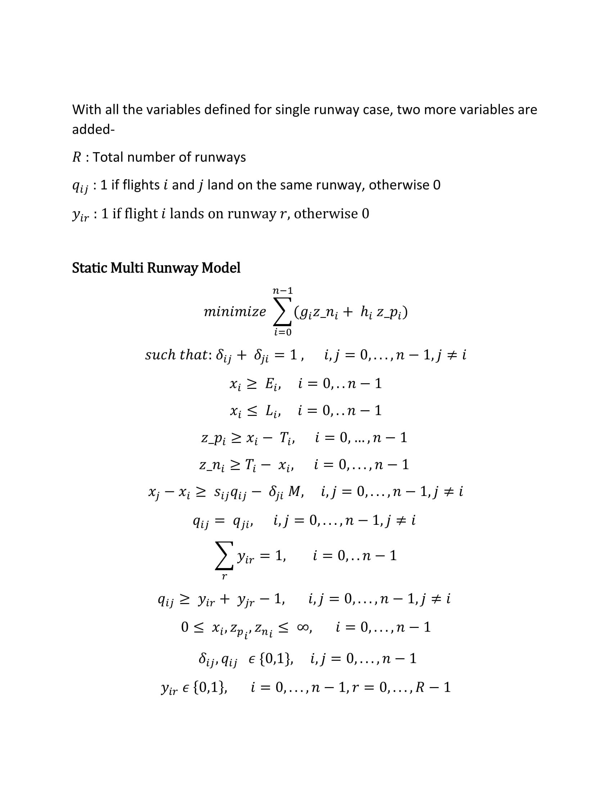

# Aircraft-Landing-Schedule
MILP Models for scheduling aircraft landings for static/dynamic and single/multiple runway cases.

## Problem Statement
The problem is to schedule aircraft landings within a predetermined time frame. 
The problem is solved in real time at major airports handling hundreds of flights in a day.
The landings not only need to be scheduled within a predetermined (slightly relaxed) time frame but also satisfy clearance time between consecutive flights depending upon various factors such as aircraft size, taxing traffic, airport arrival capacity, for safety reasons. The flights are given a target time when they are supposed to land, ideally. A penalty cost is associated with every unit of time landings divert from the target time. The objective is schedule landings in such a way that penalty can be minimized.

Two cases-

[1] Static Case- In this case, the appearance time of the flights is known. This is an optimistic case as in reality, the appearance time is not known beforehand. A mixed integer linear programming model is developed to solve the scheduling problem.

[2] Dynamic Case- This is more realistic and complex case. The model has no knowledge of appearance time. The flights are to be scheduled as they appear. Now, in this dynamic case, as more flights appear the flights that have already been assigned a landing time may be rescheduled, of course unless they are so close that they can't be rescheduled. The flights which can't be rescheduled are referenced as to have their landing time frozen. It is also undesirable to perturb the previous decisions of landing too much. So, there needs to be some cost associated with the perturbation that is made in making new decisions.

## Model

### Static Case Single Runway-

Mixed integer programming model has been developed for static case with single runway. 
In the static case, all the data is predetermined and does not change over time. The piecewise linear objective is to minimize the penalty associated with diversion of landing times from target times. The constraints include clearance time between landings, earliest landing time, latest landing time for single runway. The formulation is as follows-


### Static Case Multi Runway-

Multi Runway Static case is very similar to that of single runway with few more varibles. The formulation is as follows-



## Data Format

The format of the data files is:

```javascript
number of planes (p), freeze time

for each plane i (i=1,...,p): 
          appearance time, earliest landing time, target landing time, 
          latest landing time, penalty cost per unit of time for landing before target, 
          penalty cost per unit of time for landing after target
   
          for each plane j (j=1,...p): separation time required after 
                                i lands before j can land
```

Data reference- [OR-Library by J.E. Beasley](http://people.brunel.ac.uk/~mastjjb/jeb/info.html)
